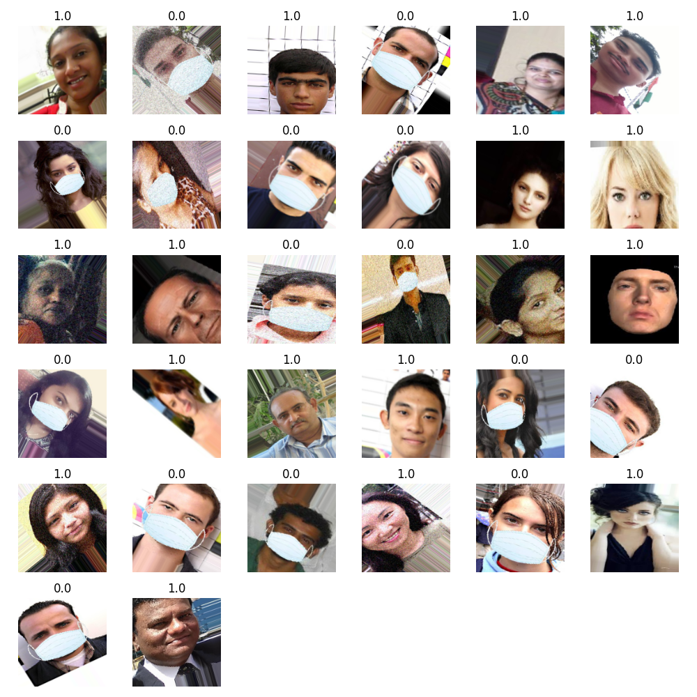
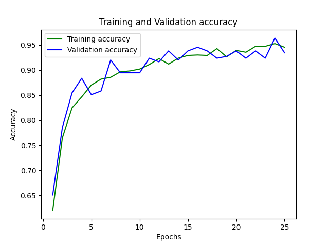
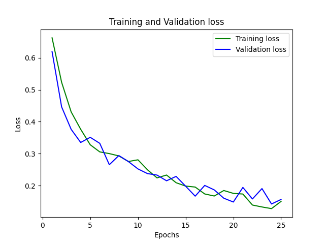

# Face Mask Detection
Real time Face Mask Detection using Deep Learning & Machine Learning to recognize whether
an individual is wearing a face mask or not. Face Mask model was built using a Sequential CNN with a series
of Convolution & Dense layers via TensorFlow. This was then used in conjunction with OpenCV facial recognition 
deep learning model to detect all faces and pass them to our Face Mask model for an assessment. This is what
powers the real time face detection module, however there is also a separate image detection module powered only by our Face Mask
model. A demonstration of the real time Face Mask Detection can be seen below:

## Installation
1. Clone the repository:
- `$ git https://github.com/AmanC92/face-mask-detection.git`
2. Navigate to the cloned repository in your system.
- `cd face-mask-detection`  
3.  Download Anaconda/Miniconda if it is not downloaded already:
- Download instructions & files can be found [here](https://docs.conda.io/projects/conda/en/latest/user-guide/install/download.html).
4. Create a virtual environment using conda, replace `venv_name` with the name you would like to give.
- `conda create -n venv_name python=3.8.5`
5. Activate the environment.
- `conda activate venv_name`
6. Install all the requirements for this project using the provided `requirements.txt` file.
- `pip install -r requirements.txt`

You're all set now! Just have your environment activated and the run the desired modules.
## Dataset
Thanks to [prajnasb](https://github.com/prajnasb/observations/tree/master/experiements/data/with_mask) for providing 
the face mask data set for this project, which can be found [here](https://github.com/prajnasb/observations/tree/master/experiements/data).

The total dataset contains **641 images**, _320 images without a mask_ and *321 images with masks*.
The dataset contains both real and augmented images of unique people wearing masks. The augmented images were collected 
by using unique images of people without masks and then afterwards the images
were processed using facial landmarks to augment subjects wearing masks.

To further expand the dataset ImageDataGenerator library was used to make transformations such as
random rotations, width and height shifts, zoom and horizontal flips. The images were then rescaled
from their typical RGB values down to between 0 and 1 for quicker computations during training.

Here is a sample of the augmented data after going through these transformations:

The labels correspond to their binary classification of _0.0 - without a mask_ and _1.0 with a mask_.

## Model Results
After training our model has a **93.45%** validation accuracy and **15.66%** validation loss. The 
training/validation accuracy/loss plots can be seen below:

It is to be noted that this model has not been optimized. I believe with some tweaks made to the Conv2D layers
as well as the epochs, and the use of save states this model can gain accuracy of 95%+. This has not been implemented
yet because the model currently produces satisfactory results for all the modules in this project, however this is to be
looked at and improved at a future date.

## License

Open source under terms of MIT [license](./LICENSE).